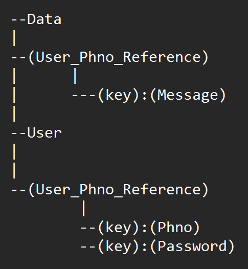
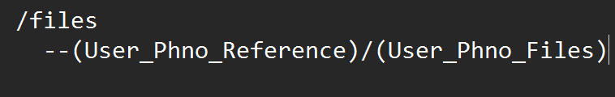
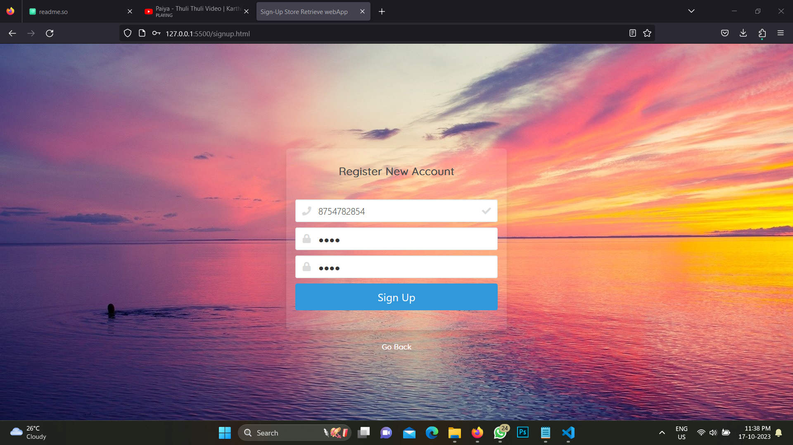
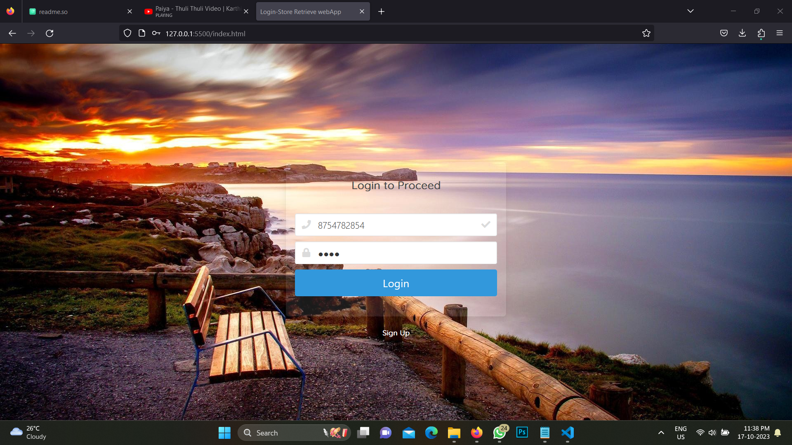
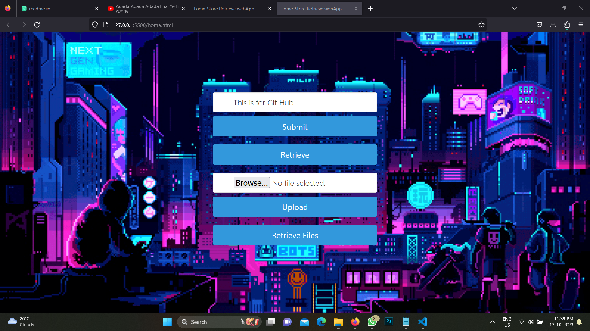
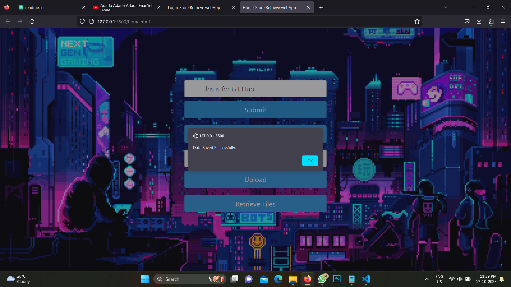
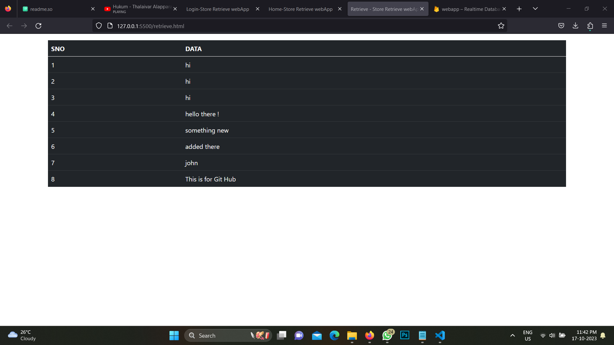
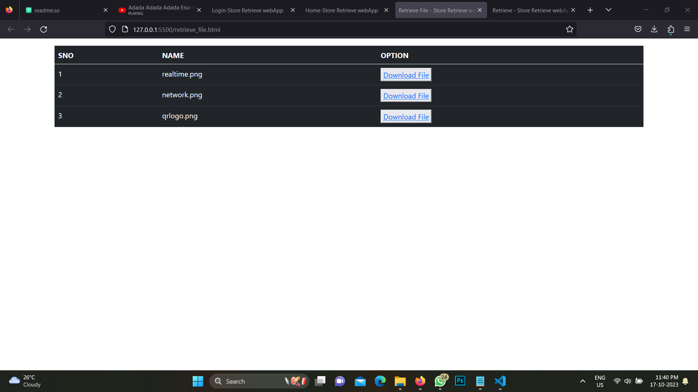

# Store Retrieve WEBapp

# Project Overview

Users can quickly save and retrieve data with this Web Application, a user-friendly web-based solution. This program offers a simple and user-friendly interface for managing your data because it was created using a combination of HTML, CSS, Javascript and leverages the Firebase Database to provide a secure and real-time data storage solution.

# Required Development Tools & Setup

- Visual Studio Code(Vscode) ⌨️ 
- Chrome or Firefox Web Browser 🌍
- Live Server Extension for Vscode 🪢 
- Internet 🛜


# Step-by-step Launch Instructions

- Perform ``` git clone https://github.com/Macgill-john/Store-Retrieve-WEBapp.git ```  or ``` Download the zip file ``` .

- If downloaded zip file then ```unzip``` that file using any desired software.
- Open ```Visual Studio Code ``` .

- Drag & drop ```Store-Retrieve WEBapp``` folder.
- Right click on ```index.html``` file and select ```open with live server```.
 **Note: If you don't have Live Server extension in Visual Studio Code...Please install it**
 - Select ```sign up``` button in bottom and Register with your Phone number and Password.
 - Once done Select ```Go back ``` button.
 - Login with your Registered Credentials.
 - A new tab will be opened and there we can Upload our files and Text Messages or Retrieve our data.
 - To Store your Text data... Type your Text Data in ```Enter something``` text box and Select ```Submit``` button.
 - To Retrieve your Text data back... Select ```Retrieve``` button and all the Stored data will be Displayed in new page.
 - To Store Your files... Select ```Browse``` button and Select your file then Press ```Upload``` button.
 -To Retrieve your Stored File back... Select ```Retrieve Files``` button and all the file name will be displayed and you can Download it.

 # Workflow of the application

 - First User must Register in Sign up page and his/her Credentials will Stored in Firebase Realtime Database.
 - Once the User try to login the Application will Retrieve back the Corresponding User Credentials from Firebase Realtime Database.
 - Application will check Entered Credentials are matching with Retrieved Credentials.
 - If Yes it will Redirect user to home page.
 - If No it will display alert dialog indicating "Invalid Credentials" and User have to feed valid Credentials again.
 - After Successful login to home page,User may feed either Text data or their files in Corresponding fields.
 - If User gave Text Data and Submited,then Application will store the data under his Reference in the Database.
 - If User gave File Data and Submited,then Application will store that data to Firebase Storage.
 - If User want to Retrieve information User can either click Retrieve to Retrieve Text data or Retrieve Files to Retrieve their files.
 - If User click Retrieve then new tab will be opened and all their data will be displayed in table 
 - If User click Retrieve Files then new tab will be opened and all their file data will be displayed in table and User can Download them back.

 #### Firebase Realtime Storage Structure
 
 
 

 # Screenshots

 
 
 
 
 
 
 
 


 

